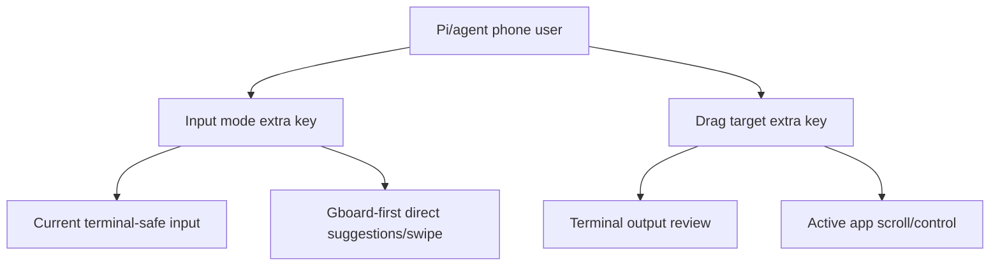
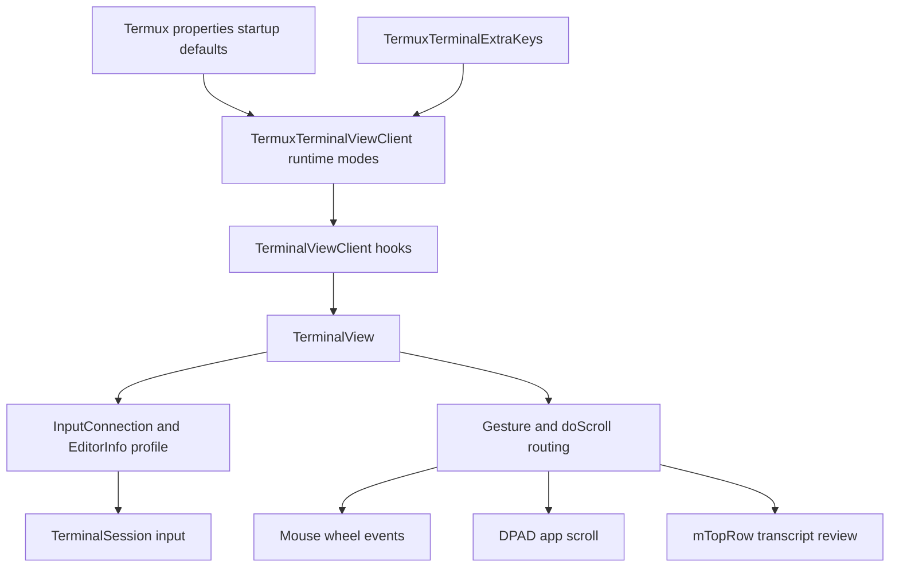
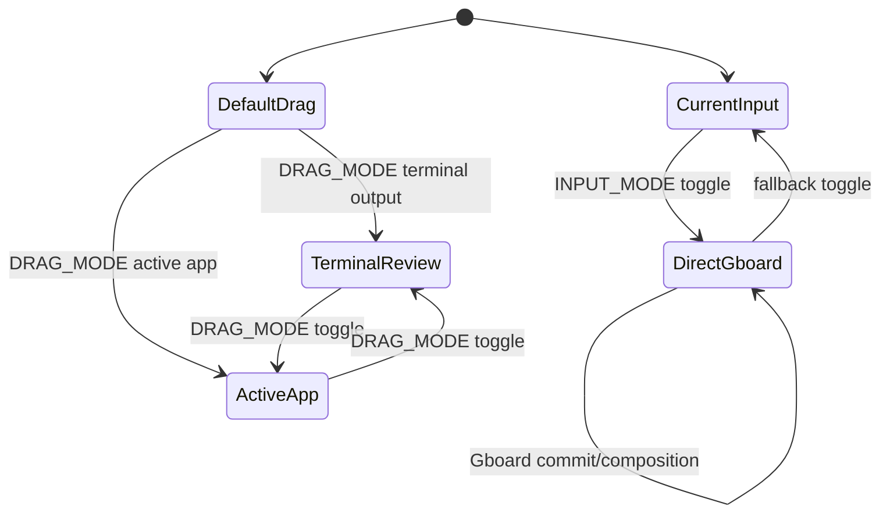

# Agent-Friendly Terminal UI - Plan

## Goal Capsule

- **Objective:** Make Termux substantially friendlier for Pi-style agent work on phones by improving direct terminal typing and touch-based review of session output.
- **Product authority:** The Product Contract is authoritative for user-facing behavior; implementation may refine names and file placement without changing opt-in scope, Gboard-first posture, or manual drag modes.
- **Execution profile:** Standard Android multi-module Gradle work across `terminal-view`, `app`, and `termux-shared`, with unit coverage where feasible and device validation for Gboard behavior.
- **Stop conditions:** Stop and re-plan before changing default input behavior for all users, making non-Gboard compatibility claims, or replacing direct terminal input with compose-then-send UX.
- **Tail ownership:** Implementation owns property names, exact labels, and test scaffolding; product scope changes return to brainstorming.

---

## Product Contract

### Summary

Termux will add agent-friendly terminal interaction controls: a Gboard-first direct swipe/autocomplete input mode for the terminal, plus extra-key-accessible drag-target modes for reviewing shell/agent output and controlling active app panes.
The controls stay independent so users can experiment, compare behavior, and quickly revert when a keyboard or terminal app behaves badly.

### Problem Frame

Running Pi in Termux currently makes phone interaction feel worse than a chat or pane-based terminal app.
The pain is not only typing speed; it is the combined friction of pecking prompts into a live terminal and being unable to naturally drag through prior session content.
The user currently pays for another app because drag scrolling each pane is essential to reviewing agent and shell output.

Termux already has a compose-then-send text input surface, but that is not the desired experience.
The target is direct swipe typing and autocomplete into the terminal, so composing agent prompts feels closer to a chat app without leaving the live terminal interaction model.

### Product Contract Preservation

Product Contract unchanged from the confirmed brainstorm scope.
Planning adds implementation approach, unit boundaries, risks, and verification without changing R-IDs, F-IDs, or acceptance examples.

### Key Decisions

- **Gboard-first direct input.** The MVP should optimize the experimental direct suggestions/swipe path for Gboard before attempting broad IME compatibility.
- **Direct terminal typing over compose-then-send.** The existing toolbar text input remains a fallback or adjacent capability, not the primary agent-input solution.
- **Independent controls over a single agent mode.** Keyboard input mode and drag target mode should be separately switchable so users can isolate failures and compare current versus new behavior.
- **Extra-key access first.** Fast in-session toggling matters more than burying the MVP in Settings, especially while behavior is experimental.
- **Separate app scrolling from terminal scrollback.** Drag behavior should distinguish reviewing Termux terminal output from controlling active full-screen apps such as `less` or `vim`.

### Actors

- A1. **Pi/agent phone user:** Runs agent and shell workflows in Termux and needs fast natural-language input plus reliable review of prior output.
- A2. **Android IME:** Supplies typed, swiped, composed, corrected, or deleted text to the terminal input surface.
- A3. **Terminal application:** A shell, Pi, `less`, `vim`, or another program that may expect text, arrow keys, mouse events, or terminal scrollback behavior.

### Requirements

**Keyboard input**

- R1. Termux must offer an opt-in direct terminal input mode intended to enable Gboard suggestions, autocomplete, and swipe typing into the live terminal.
- R2. The direct input mode must preserve a fast fallback to the current terminal-safe keyboard behavior when IME behavior is wrong or disruptive.
- R3. The MVP must treat Gboard as the first validated keyboard and label broader keyboard compatibility as unknown until tested.
- R4. The direct input mode must not route users through the existing compose-then-send toolbar text field as the primary experience.
- R5. The input behavior must account for IME composition, committed text, newline behavior, and deletion/correction without assuming every keyboard behaves like Gboard.

**Drag and scroll behavior**

- R6. Termux must provide an extra-key-accessible control for changing the drag target during a terminal session.
- R7. One drag target must prioritize reviewing Termux terminal output so the user can inspect past Pi and shell session content naturally.
- R8. One drag target must prioritize active app scrolling/control for full-screen or pane-like programs such as `less` and `vim`.
- R9. The MVP must prefer manual mode selection over automatic detection of the perfect drag behavior.
- R10. Drag mode labels must make clear whether the user is controlling terminal scrollback or the active app.

**Integration and safety**

- R11. The new controls must fit the existing extra-keys pattern, where special keys such as keyboard and scroll actions can trigger Termux UI behavior.
- R12. The UI must make experimentation reversible enough that a bad keyboard mode or drag mode does not strand the user.
- R13. The behavior must preserve existing terminal use cases unless the user opts into the new modes.

### Key Flows

- F1. **Enable direct Gboard input**
  - **Trigger:** A Pi/agent phone user wants to compose a natural-language prompt in Termux.
  - **Actors:** A1, A2, A3
  - **Steps:** The user switches to the direct input mode, focuses the terminal, swipe-types with Gboard, and committed text is sent into the live terminal.
  - **Outcome:** Prompt entry feels closer to chat typing while staying in the terminal session.
  - **Covered by:** R1, R2, R3, R5

- F2. **Recover from bad IME behavior**
  - **Trigger:** Suggestions, corrections, deletion, or composition behaves incorrectly for the terminal.
  - **Actors:** A1, A2
  - **Steps:** The user activates the fast fallback control and returns to the current terminal-safe input behavior.
  - **Outcome:** Experimentation is safe because the user can keep working.
  - **Covered by:** R2, R12, R13

- F3. **Review agent output by dragging**
  - **Trigger:** A Pi session has produced output the user needs to inspect.
  - **Actors:** A1, A3
  - **Steps:** The user selects the terminal-output drag target and drags through the session content.
  - **Outcome:** The user can review past session content without fighting active app input semantics.
  - **Covered by:** R6, R7, R9, R10

- F4. **Control an active terminal app by dragging**
  - **Trigger:** The user is inside a full-screen app or pane-like terminal program and wants drag gestures to affect that app.
  - **Actors:** A1, A3
  - **Steps:** The user selects the active-app drag target and drags within the terminal.
  - **Outcome:** The gesture controls the active app instead of forcing terminal scrollback behavior everywhere.
  - **Covered by:** R6, R8, R10

### Interaction Shape

### Acceptance Examples

- AE1. **Covers R1, R3, R5.** Given Gboard is active and direct input mode is selected, when the user swipe-types a prompt, then committed text appears in the live terminal without using the toolbar compose field.
- AE2. **Covers R2, R12.** Given direct input mode is producing bad corrections or deletion behavior, when the user toggles back, then current terminal-safe input resumes without restarting Termux.
- AE3. **Covers R6, R7.** Given Pi has produced scrollback output, when the user selects the terminal-output drag target and drags, then the interaction prioritizes reviewing prior terminal content.
- AE4. **Covers R6, R8.** Given a full-screen terminal app is active, when the user selects active-app drag mode and drags, then the gesture is intended for the app rather than generic terminal output review.
- AE5. **Covers R9, R10.** Given both drag modes exist, when the user changes modes, then the current target is understandable enough that the user can predict what dragging will do.

### Success Criteria

- The user can run Pi in Termux on a phone and type natural-language prompts with Gboard swipe/autocomplete directly into the terminal.
- The user can naturally drag through Pi and shell output to review past session content.
- The user can switch drag behavior for active app panes instead of being locked into one interpretation of touch movement.
- The MVP makes current behavior easy to restore when an experimental mode is unsuitable.

### Scope Boundaries

- **Deferred:** Broad compatibility guarantees for non-Gboard keyboards.
- **Deferred:** Automatic detection of the correct drag target for every terminal state.
- **Deferred:** A combined agent cockpit mode that flips keyboard and drag behavior together.
- **Outside MVP:** Replacing direct terminal typing with the existing compose-then-send toolbar field.
- **Outside MVP:** Changing defaults for all Termux users before opt-in behavior is validated.

### Dependencies / Assumptions

- The direct input mode depends on Android IME behavior that is known to vary by keyboard.
- Gboard is the initial compatibility target because it is the desired user workflow and a concrete validation surface.
- Terminal full-screen and alternate-screen behavior may limit when prior scrollback is available; the product requirement is to label and separate modes clearly rather than hide that constraint.

### Sources / Research

- `terminal-view/src/main/java/com/termux/view/TerminalView.java` confirms terminal input currently chooses between visible-password/no-suggestions and `TYPE_NULL`, with a normal text-like path used when the terminal view is not selected.
- `app/src/main/res/layout/view_terminal_toolbar_text_input.xml` and `app/src/main/java/com/termux/app/terminal/io/TerminalToolbarViewPager.java` confirm the existing compose-then-send toolbar input.
- `app/src/main/java/com/termux/app/terminal/io/TermuxTerminalExtraKeys.java` confirms special extra-key actions including `KEYBOARD` and `SCROLL`.
- `terminal-view/src/main/java/com/termux/view/TerminalView.java` confirms current drag/scroll routing across mouse tracking, alternate buffer, and transcript scrollback.
- `terminal-emulator/src/main/java/com/termux/terminal/TerminalEmulator.java` documents that saved scrollback cannot be viewed while the alternate screen buffer is active.
- Android documentation for `InputType`, `EditorInfo`, `InputConnection`, and `BaseInputConnection` confirms the platform contracts that govern IME suggestions, composition, committed text, and editor options.

---

## Planning Contract

### Key Technical Decisions

- **KTD1. Add explicit enum-style modes instead of overloading `enforce-char-based-input`.** Current code already uses `enforce-char-based-input` as a compatibility workaround, so a separate input-mode property keeps the existing behavior stable and makes the experimental Gboard path reversible.
- **KTD2. Extend `TerminalViewClient` for app-owned configuration.** `terminal-view` should ask its client for input and drag modes rather than depending on Termux app classes or property storage; every existing `TerminalViewClient` implementation must return current-behavior defaults.
- **KTD3. Keep fast toggles in Termux-specific extra-key handling.** `TermuxTerminalExtraKeys` already handles `KEYBOARD`, `DRAWER`, `PASTE`, and `SCROLL` as UI actions, so new mode actions should follow that pattern before any broader toolbar redesign.
- **KTD4. Own runtime mode overrides in the app client.** Properties provide startup defaults; extra-key toggles update in-memory overrides owned by `TermuxTerminalViewClient`, then refresh the terminal input connection and user-visible mode feedback immediately.
- **KTD5. Centralize touch scroll-routing policy near `TerminalView.doScroll()`.** Drag behavior currently fans out by mouse tracking, alternate buffer, and transcript state, so the manual mode decision should be source-aware and applied to touch drag/fling without changing physical mouse wheel behavior by accident.
- **KTD6. Treat Gboard validation as required evidence, not a unit-test substitute.** Android unit tests can verify selected `EditorInfo` flags and fallback behavior, but only an on-device/manual pass can prove swipe, composition, suggestion, correction, and delete behavior with Gboard.

### High-Level Technical Design

### Implementation Assumptions

- Exact property keys and extra-key action names can be finalized during implementation, but they should be clear enough for user-customized extra keys.
- The direct Gboard mode can start with a normal text-like `InputType` profile and iterate only if manual validation shows Gboard needs additional flags.
- Existing behavior remains the default for both keyboard input and drag routing.
- Runtime toggles are session-local unless implementation deliberately adds persistence; persisted properties are the startup defaults.
- Active-app drag mode may use existing mouse-tracking and alternate-buffer behavior as its base behavior.
- Terminal-output drag mode cannot make alternate-screen saved scrollback appear when the emulator has no saved lines for that buffer.

### Sources and Research

- Repo research found no `docs/solutions` or `CONCEPTS.md`, so this plan relies on source inspection, the Product Contract, and Android platform documentation.
- `terminal-view/src/main/java/com/termux/view/TerminalView.java` is the primary implementation seam for both IME and drag behavior.
- `terminal-view/src/main/java/com/termux/view/TerminalViewClient.java` is the app/view boundary to extend.
- `termux-shared/src/main/java/com/termux/shared/termux/settings/properties/TermuxPropertyConstants.java` and `termux-shared/src/main/java/com/termux/shared/termux/settings/properties/TermuxSharedProperties.java` define the property-key, default, enum-map, and getter patterns to follow.
- `app/src/main/java/com/termux/app/terminal/io/TermuxTerminalExtraKeys.java` is the Termux-specific extra-key special-action hook.

### Risks and Mitigations

| Risk | Mitigation |
|---|---|
| Gboard direct input behaves differently from code-level assumptions. | Add manual validation as a required done criterion and keep a fast fallback toggle. |
| Non-Gboard keyboards regress if the new input mode is too broad. | Keep current behavior as default and label the new mode Gboard-first/experimental. |
| Drag modes confuse users inside alternate-screen apps. | Use mode labels and documentation that distinguish terminal output review from active app control. |
| Extra-key action strings become discoverability debt. | Add display aliases and user-facing notes where existing extra-key documentation/config examples live. |
| `terminal-view` lacks existing unit-test depth for Android view behavior. | Add the smallest test seam that proves mode selection and route decisions, then rely on app/interaction validation for IME specifics. |

---

## Implementation Units

### U1. Add terminal input and drag mode configuration

- **Goal:** Introduce typed configuration values for terminal input mode and drag target mode without changing defaults.
- **Requirements:** R1, R2, R3, R6, R9, R13
- **Dependencies:** None
- **Files:**
  - `termux-shared/src/main/java/com/termux/shared/termux/settings/properties/TermuxPropertyConstants.java`
  - `termux-shared/src/main/java/com/termux/shared/termux/settings/properties/TermuxSharedProperties.java`
  - `terminal-view/src/main/java/com/termux/view/TerminalViewClient.java`
  - `app/src/main/java/com/termux/app/terminal/TermuxTerminalViewClient.java`
  - `termux-shared/src/main/java/com/termux/shared/termux/terminal/TermuxTerminalViewClientBase.java`
  - `termux-shared/src/test/java/com/termux/shared/termux/settings/properties/TermuxSharedPropertiesTest.java` or the nearest existing shared-properties test location
- **Approach:** Add enum-like property values for terminal input behavior and drag target behavior using the existing `MAP_*` and getter pattern in `TermuxPropertyConstants` and `TermuxSharedProperties`.
Add narrow methods to `TerminalViewClient` so `TerminalView` can ask for modes without knowing app storage.
Update `TermuxTerminalViewClientBase` with default hook values that preserve current behavior.
Default both modes to current behavior.
- **Patterns to follow:** `KEY_SOFT_KEYBOARD_TOGGLE_BEHAVIOUR`, `MAP_SOFT_KEYBOARD_TOGGLE_BEHAVIOUR`, and getters such as `isEnforcingCharBasedInput()`.
- **Test scenarios:**
  - Default properties return current-safe input mode and default drag behavior when no property is set.
  - Valid literal values map to the expected internal mode values.
  - Invalid literal values fall back to defaults and do not crash property loading.
  - `TermuxTerminalViewClient` returns startup mode values from `TermuxSharedProperties` through the new client hooks.
  - `TermuxTerminalViewClientBase` compiles after interface changes and returns current-behavior defaults.
- **Verification:** Property parsing, default preservation, and client hook wiring are covered by JVM tests or a small app-level test seam.

### U2. Implement Gboard-first direct terminal input mode

- **Goal:** Add an opt-in terminal input profile that allows Gboard suggestions/swipe input while preserving current input behavior as fallback.
- **Requirements:** R1, R2, R3, R4, R5, R12, R13; covers F1, F2, AE1, AE2
- **Dependencies:** U1
- **Files:**
  - `terminal-view/src/main/java/com/termux/view/TerminalView.java`
  - `terminal-view/src/main/java/com/termux/view/TerminalViewClient.java`
  - `app/src/main/java/com/termux/app/terminal/TermuxTerminalViewClient.java`
  - `terminal-view/src/test/java/com/termux/view/TerminalViewInputConnectionTest.java` or an app Robolectric test if `terminal-view` cannot host the needed Android view test
- **Approach:** Extend `onCreateInputConnection()` so terminal-selected input can choose between current behavior and a direct text-like mode.
The direct mode should avoid `TYPE_NULL` and avoid `TYPE_TEXT_FLAG_NO_SUGGESTIONS`, then continue using the existing `BaseInputConnection` commit path unless Gboard validation exposes a specific composition issue.
Do not route through `view_terminal_toolbar_text_input.xml`.
- **Execution note:** Start with characterization tests for existing `EditorInfo.inputType` selection before adding the new branch.
- **Patterns to follow:** Existing `onCreateInputConnection()` comments and `sendTextToTerminal()` handling for committed text, newline conversion, control characters, shift state, and delete events.
- **Test scenarios:**
  - Existing enforced char-based mode still sets visible-password/no-suggestions.
  - Existing non-enforced mode still sets `TYPE_NULL`.
  - Direct Gboard mode sets a text-class input type that permits suggestions and is only used when the terminal view is selected.
  - `commitText()` still sends committed text to the terminal and clears editable state.
  - `finishComposingText()` and any implemented composing-text path do not duplicate-send text when Gboard finalizes a swipe suggestion.
  - Correction/replacement behavior either works directly or falls back safely without corrupting the terminal input stream.
  - Newline/send behavior still maps terminal enter expectations correctly.
  - `deleteSurroundingText()` still produces delete key events for requested left-length deletes.
  - Covers AE1. Direct mode does not use the toolbar compose-then-send field.
  - Covers AE2. Switching back to current mode restores the old `EditorInfo` profile after input connection recreation.
- **Verification:** Unit/Robolectric coverage proves mode selection and existing commit/delete behavior; manual validation proves Gboard swipe, suggestions, correction, newline, and fallback on a device.

### U3. Implement drag target routing modes

- **Goal:** Add manual drag target modes for terminal output review and active app control while keeping current drag behavior as default.
- **Requirements:** R6, R7, R8, R9, R10, R13; covers F3, F4, AE3, AE4, AE5
- **Dependencies:** U1
- **Files:**
  - `terminal-view/src/main/java/com/termux/view/TerminalView.java`
  - `terminal-view/src/main/java/com/termux/view/TerminalViewClient.java`
  - `app/src/main/java/com/termux/app/terminal/TermuxTerminalViewClient.java`
  - `terminal-view/src/test/java/com/termux/view/TerminalViewScrollModeTest.java` or an app Robolectric test if needed
- **Approach:** Add a source-aware routing seam around touch drag and touch fling behavior that delegates to `doScroll()` or transcript movement as appropriate.
Default mode preserves current routing.
Terminal-output review mode should prioritize transcript movement where transcript rows are available.
Active-app mode should prioritize existing mouse-tracking and alternate-buffer app behavior.
Text selection, physical mouse wheel, and hardware-key behavior should keep their existing specialized paths unless explicitly brought into scope later.
- **Execution note:** Characterize current `doScroll()` routing first so the default mode remains unchanged.
- **Patterns to follow:** Existing `doScroll()` order, `mTopRow` transcript bounds, mouse wheel event dispatch, alternate-buffer DPAD fallback, and fling abort behavior when mouse tracking state changes.
- **Test scenarios:**
  - Default drag mode preserves mouse-tracking, alternate-buffer, and normal transcript routing.
  - Physical mouse wheel and hardware-key scrolling remain unchanged by touch drag mode selection.
  - Terminal-output review mode adjusts transcript position when transcript rows are available.
  - Terminal-output review mode handles alternate-screen state without claiming unavailable saved scrollback.
  - Active-app mode sends mouse wheel events when mouse tracking is active.
  - Active-app mode sends DPAD up/down in alternate-buffer apps without mouse tracking.
  - Covers AE3. Dragging in terminal-output mode supports reviewing prior output.
  - Covers AE4. Dragging in active-app mode is intended for the active app.
  - Covers AE5. Mode changes produce predictable route changes.
- **Verification:** Route-selection tests cover the core state matrix; manual validation covers real dragging in shell output, Pi output, `less`, and `vim`.

### U4. Add extra-key actions for fast mode switching

- **Goal:** Expose keyboard input fallback and drag target switching through user-configurable extra-key actions.
- **Requirements:** R2, R6, R10, R11, R12; covers F2, F3, F4, AE2, AE5
- **Dependencies:** U1, U2, U3
- **Files:**
  - `app/src/main/java/com/termux/app/terminal/io/TermuxTerminalExtraKeys.java`
  - `termux-shared/src/main/java/com/termux/shared/termux/extrakeys/ExtraKeysConstants.java`
  - `termux-shared/src/main/java/com/termux/shared/termux/extrakeys/ExtraKeysInfo.java`
  - `app/src/main/java/com/termux/app/TermuxActivity.java`
  - `app/src/test/java/com/termux/app/terminal/io/TermuxTerminalExtraKeysTest.java` or the nearest app-level Robolectric test location
- **Approach:** Add Termux-specific special key strings for input mode and drag mode toggles, following the existing `KEYBOARD` and `SCROLL` dispatch pattern.
Update in-memory mode overrides on `TermuxTerminalViewClient`, using persisted properties only as startup defaults.
Refresh the input connection after input-mode changes and surface the current mode through a toast, label, or equivalent feedback.
Add display aliases for the new action strings so custom extra-key rows are understandable.
- **Patterns to follow:** `KEYBOARD` toggle, `SCROLL` auto-scroll toggle, `ExtraKeysConstants.EXTRA_KEY_DISPLAY_MAPS`, and `ExtraKeysInfo` custom display support.
- **Test scenarios:**
  - Pressing the input-mode extra key toggles between current-safe and direct Gboard modes.
  - Pressing the drag-mode extra key cycles or switches between terminal-output and active-app modes.
  - Unknown extra-key strings still fall back to generic terminal extra-key handling.
  - Covers AE2. The input fallback action can restore current-safe input without restarting the app.
  - Covers AE5. Drag mode action exposes a predictable current target through label, toast, or equivalent feedback.
- **Verification:** App-level tests or targeted unit seams prove special-action dispatch; manual validation proves the actions are reachable from a custom extra-keys row.

### U5. Add extra-key-first documentation and minimal labels

- **Goal:** Make experimental modes discoverable and explain their limitations without adding a broad Settings UI in the MVP.
- **Requirements:** R3, R10, R11, R12, R13
- **Dependencies:** U1, U4
- **Files:**
  - `termux-shared/src/main/java/com/termux/shared/termux/extrakeys/ExtraKeysConstants.java`
  - `app/src/main/res/values/strings.xml`
  - `README.md` or the repo-local documentation page that covers terminal settings and touch keyboard configuration
- **Approach:** Document the `termux.properties` startup defaults and extra-key action names, and add only the labels/toasts needed for users to understand the current mode.
Defer a permanent Terminal I/O Settings UI until the MVP behavior is validated.
- **Patterns to follow:** Existing extra-key display aliases, `ExtraKeysInfo` custom display support, and current README links to terminal settings/touch keyboard docs.
- **Test scenarios:**
  - Documented property defaults preserve current behavior.
  - User-facing text labels direct mode as Gboard-first/experimental rather than universally compatible.
  - Drag-mode text distinguishes terminal output review from active app control.
  - Extra-key examples include the new mode actions and remain parseable by `ExtraKeysInfo`.
- **Verification:** Documentation accurately reflects mode names, startup defaults, extra-key actions, and fallback behavior.

### U6. Validate end-to-end behavior on device

- **Goal:** Prove the MVP works in the real phone workflows that motivated the feature.
- **Requirements:** R1, R2, R3, R5, R7, R8, R10, R12; covers all acceptance examples
- **Dependencies:** U2, U3, U4, U5
- **Files:**
  - `docs/plans/2026-07-08-001-feat-agent-friendly-terminal-ui-plan.md`
  - Manual validation notes in the PR body or a repo-appropriate test note location
- **Approach:** Run a manual validation pass with Gboard and representative terminal states: normal shell/Pi output, `less`, `vim`, direct prompt entry, corrections/deletes, newline/send behavior, and fallback toggles.
Do not claim support for other keyboards unless they are tested.
- **Execution note:** This is the primary proof for Gboard swipe/autocomplete; do not treat passing unit tests as sufficient for R1/R3/R5.
- **Patterns to follow:** Existing manual release/test notes in project PRs if available; otherwise keep validation evidence in the PR description.
- **Test scenarios:**
  - Covers AE1. With Gboard, swipe typing commits prompt text directly into the terminal.
  - Covers AE2. Direct input mode can be reverted immediately after a bad correction/delete case.
  - Covers AE3. Dragging reviews prior Pi/shell output in terminal-output mode.
  - Covers AE4. Dragging controls `less` or `vim` in active-app mode.
  - Covers AE5. The user can identify and change the current drag target.
- **Verification:** Manual validation results are documented with device, Android version, keyboard version, tested modes, and observed failures.

---

## Verification Contract

| Scope | Command or check | Purpose |
|---|---|---|
| Shared properties | `./gradlew :termux-shared:testDebugUnitTest` | Proves property parsing/defaults if tests are added in `termux-shared`. |
| Terminal view | `./gradlew :terminal-view:testDebugUnitTest` | Proves input-mode and drag-routing seams where local JVM/Robolectric coverage is possible. |
| App wiring | `./gradlew :app:testDebugUnitTest` | Proves extra-key dispatch, runtime override ownership, and minimal label wiring where app tests are added. |
| Emulator regression | `./gradlew :terminal-emulator:testDebugUnitTest` | Guards terminal key/protocol behavior if implementation touches emulator-adjacent logic. |
| Full build smoke | `./gradlew assembleDebug` | Confirms Android resources, module dependencies, and compile-time integration. |
| Device validation | Manual Gboard + drag checklist from U6 | Proves IME and touch behavior that unit tests cannot reliably simulate. |

Automated tests should be added for mode selection, property parsing, extra-key dispatch, and route decisions.
Manual validation is required before calling Gboard-first direct input done.

---

## Definition of Done

- Product Contract remains preserved unless a product-scope change is explicitly confirmed.
- Current keyboard and drag behavior remain the default for existing users.
- Direct Gboard mode is opt-in, extra-key-reversible, and validated on a physical or equivalent Android device with Gboard.
- Drag target modes are reachable from extra keys and distinguish terminal-output review from active app control.
- Unit/Robolectric coverage exists for all feasible property, mode-selection, dispatch, and route-decision behavior.
- User-facing text does not claim broad IME compatibility or impossible alternate-screen scrollback.
- Documentation or PR notes tell users how to configure the new extra-key actions and how to revert.
- Dead experimental code and unused mode names are removed before merge.

### Per-Unit Done Signals

- **U1:** New modes parse, default, and flow through all client implementations without affecting current behavior.
- **U2:** `EditorInfo` selection has automated coverage and Gboard direct input has manual evidence.
- **U3:** Drag route decisions have automated coverage for default, terminal-output, and active-app modes.
- **U4:** Extra-key actions switch modes and preserve generic extra-key fallback for unknown strings.
- **U5:** Documentation and minimal mode feedback are accurate and consistent with the extra-key-first MVP.
- **U6:** Manual validation records device, Android, Gboard version, tested flows, and any known limitations.
